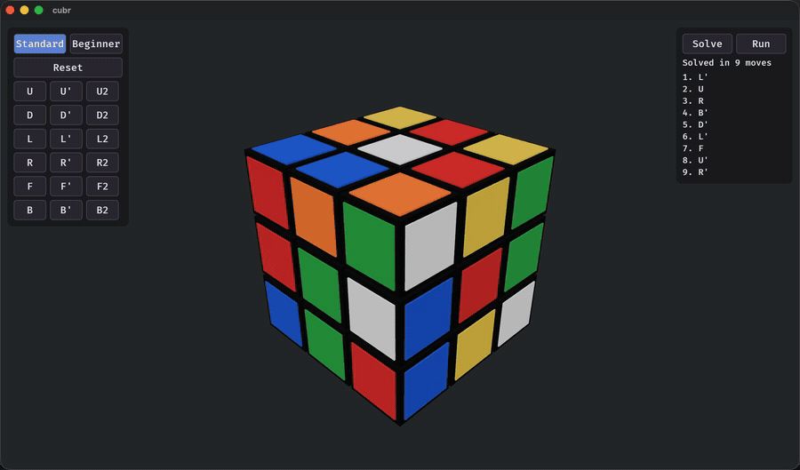
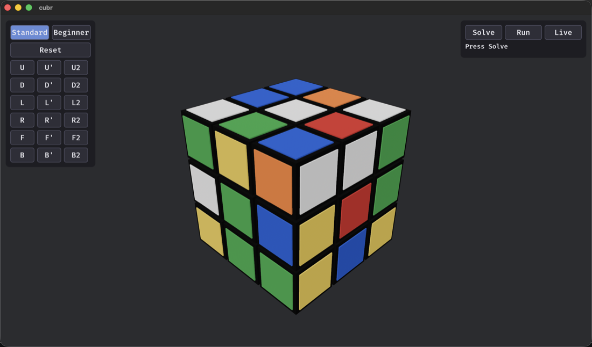

# cubr

**An interactive 3×3×3 Rubik's cube in Rust + [Bevy](https://bevyengine.org/) — drag to turn the layers, solve it in the fewest possible moves, and drive it over a small local HTTP API.**




`cubr` renders a fully interactive 3×3×3 cube, animates all 18 face turns, computes the **optimal
(fewest-move) solution** for any reachable state, and exposes an HTTP API so external tools can read
and set the cube.

---

## Features

- **Full 3×3×3 in 3D**, all 18 turns (`U D L R F B`, each `· ' 2`) with smooth ~0.25 s animation.
- **Two ways to turn**: grab a visible layer and flick it (mesh-picked swipe), or use the on-screen
  move panel.
- **Orbit camera** — a re-basing turntable that keeps the horizon level as you tumble (the "pole"
  follows the nearest cube axis), plus wheel zoom and an `L`-to-level shortcut.
- **Standard & Beginner control schemes** — the move panel can show absolute notation (`R`, `U'`,
  `F2`) or view-relative words (`Front CW`, `Up 180`) that track the camera.
- **Guaranteed-optimal solver** — Korf's IDA\* with pattern databases; every solution is the true
  minimum, ≤ 20 face turns. See [Solving](#solving).
- **Local HTTP control API** — `POST /move` and `POST /state` on `localhost:3000`. See
  [HTTP API](#http-api).
- **Reset** to a solved cube and the starting camera.

## Controls

| Input | Action |
|-------|--------|
| Left-drag empty space | Orbit the camera |
| Left-drag a sticker | Turn that layer (swipe) |
| Mouse wheel | Zoom |
| `L` | Snap the camera back to level / upright |
| Left panel | Per-move buttons (Standard or Beginner scheme) + **Reset** |
| Right panel | **Solve** (compute the optimal solution) + **Run** (animate it) |



## Quick start

Prerequisites: a stable Rust toolchain ([rustup](https://rustup.rs/)).

```bash
cargo run -p cubr --release
```

This opens the cube window and starts the HTTP API on `localhost:3000`. On the **first launch** the
solver builds its pattern databases (~85 MB) in the background — a one-time cost of roughly 20 s in a
release build — and caches them under `~/.cache/cubr/`; subsequent launches load them in well under a
second. (The cache is generated on your machine, never bundled.)

Apply a move from the command line while the app is running:

```bash
curl -X POST localhost:3000/move -H 'Content-Type: application/json' -d '{"move":"R"}'
```

> Developed and tested on macOS; Bevy targets macOS, Linux, and Windows.

## Download

Prebuilt, self-contained binaries are on the
[**Releases** page](https://github.com/buzzlightyear1309/cubr/releases). Grab the archive for your
platform (macOS arm64/x64, Linux x64, Windows x64), unpack it, and run `cubr` — no separate assets to
install (the solver's pattern databases are generated on first launch and cached locally).

> **macOS**: the build is unsigned. After unpacking, in Terminal run
> `xattr -dr com.apple.quarantine ./cubr` once, then `./cubr` (or right-click → Open). Otherwise
> you'll see a Gatekeeper warning — expected for an unsigned app.

**Cutting a release (maintainers):** pushing a `v*` tag triggers the release workflow, which builds
all four platform binaries and publishes a GitHub Release with the archives attached:

```bash
git tag v0.1.0 && git push origin v0.1.0
```

## Solving

`cubr` doesn't just find *a* solution — it finds an **optimal** one, every time.

- **Color scheme**: the standard Western / BOY layout — white `U` on top, green `F` in front, so red
  is right, orange left, blue back, yellow bottom.
- **Metric**: the half-turn metric (HTM); the 18 moves are the six faces × {90° CW, 90° CCW, 180°}.
- **Algorithm**: Herbert Kociemba / Richard Korf style **iterative-deepening A\*** guided by three
  additive-style pattern databases — one over all eight corners (permutation × orientation), and two
  over disjoint groups of six edges (positions × orientation) — combined as a *max-of-three*
  admissible heuristic. Because the heuristic never overestimates, IDA\* returns a provably
  shortest move sequence (God's number for the 3×3×3 is 20 HTM, so solutions are always ≤ 20).
- **Notation**: solutions render as Standard notation (`R U R' U'`) or, in Beginner mode, as
  view-relative steps (`Front CW`, `Up 180`) that re-label live as you orbit. **Run** animates the
  solution one move at a time and highlights the current step.
- **Performance**: most states solve in milliseconds; the rare deepest (distance ~18–20) states can
  take a few seconds. The solve runs off the render thread, so the window stays responsive, and a
  Reset cancels an in-flight solve.

## HTTP API

JSON in, JSON out, on `http://localhost:3000`. The server runs on its own thread and hands commands to
the renderer over a channel, so the render loop never blocks.

### `POST /move`

Apply a single animated move. Body:

```json
{ "move": "R" }
```

`move` is one of the 18 strings `U U' U2  D D' D2  L L' L2  R R' R2  F F' F2  B B' B2`. Responds
`200 OK`, or `400` with a message for an unknown move.

### `POST /state`

Set the entire cube instantly (no animation) — used to mirror an externally-tracked cube. The body is
the [cube-state JSON](#cube-state-format). Responds `200 OK`, or `400` if the body is malformed. The
endpoint paints the stickers exactly as given, so even physically impossible arrangements render.

```bash
curl -X POST localhost:3000/state -H 'Content-Type: application/json' -d @state.json
```

## Cube-state format

This is the exact shape of `POST /state`, and the canonical representation any external client should
produce or consume. It is the binding contract — the renderer, the move engine, the solver, and any
HTTP client all agree on it.

A state is a JSON object with one key per face. Each value is an array of **9 color codes** in
**row-major order** (top-left → bottom-right) as the face is viewed in its standard orientation.

### Faces and colors

| Letter | Face | Solved color | | Code | Color |
|--------|------|--------------|-|------|-------|
| `U` | Up | White (`W`) | | `W` | White |
| `D` | Down | Yellow (`Y`) | | `Y` | Yellow |
| `F` | Front | Green (`G`) | | `R` | Red |
| `B` | Back | Blue (`B`) | | `O` | Orange |
| `R` | Right | Red (`R`) | | `B` | Blue |
| `L` | Left | Orange (`O`) | | `G` | Green |

Color codes are independent of face position, so a scrambled (or impossible) cube can be expressed.

### Coordinate system

Right-handed axes, cube centered at the origin, each cubie one unit:

- `+X` → Right (`R`), `-X` → Left (`L`)
- `+Y` → Up (`U`),    `-Y` → Down (`D`)
- `+Z` → Front (`F`), `-Z` → Back (`B`)

A bare move (`U`, `R`, `F`, …) is a 90° turn clockwise **as seen looking at that face from outside**;
`'` is counter-clockwise; `2` is 180°.

### Per-face read order

Each face is read holding the cube in the standard orientation (white `U` up, green `F` toward you).
Index `0` is the top-left sticker, index `8` the bottom-right:

| Face | Viewed from… | Index 0 (top-left) toward… | Rows | Columns |
|------|--------------|----------------------------|------|---------|
| `U` | above (`+Y`) | back-left (`-X,-Z`) | back → front | left → right |
| `D` | below (`-Y`) | front-left (`-X,+Z`) | front → back | left → right |
| `F` | front (`+Z`) | top-left (`+Y,-X`) | top → bottom | left → right |
| `B` | back (`-Z`) | top-right\* (`+Y,+X`) | top → bottom | right → left |
| `R` | right (`+X`) | top-front (`+Y,+Z`) | top → bottom | front → back |
| `L` | left (`-X`) | top-back (`+Y,-Z`) | top → bottom | back → front |

```
0 1 2
3 4 5
6 7 8     (index 4 is the center, which fixes the face's solved color)
```

\* `B` is read as if you walked around to face it head-on, so its left/right are mirrored relative to
`F`. This matches the common Kociemba-style facelet layout the solver uses internally.

### Solved example

```json
{
  "U": ["W","W","W","W","W","W","W","W","W"],
  "R": ["R","R","R","R","R","R","R","R","R"],
  "F": ["G","G","G","G","G","G","G","G","G"],
  "D": ["Y","Y","Y","Y","Y","Y","Y","Y","Y"],
  "L": ["O","O","O","O","O","O","O","O","O"],
  "B": ["B","B","B","B","B","B","B","B","B"]
}
```

Recommended (non-fatal) sanity checks a client may surface as warnings: exactly 6 face keys each with
9 entries; every entry one of `W Y R O B G`; each color appearing exactly 9 times across the 54
stickers.

## How it works

- **`CubeCore`** is the single source of truth: a pure, integer-math model of the 26 cubies (positions
  and orientations as integer vectors, colors riding along). No Bevy, fully unit-tested. The Bevy
  entities *mirror* it; between moves every transform sits exactly on the integer grid / 90° multiples.
- **Moves** are applied as integer permutations of a layer; the animation system eases the visual
  toward the already-applied core pose, then snaps it back onto the grid.
- **Solver** (`crates/cubr-core/src/solver/`) is pure and standalone: `coords` (permutation/orientation
  ranking + the move model), `pdb` + `cache` (the three pattern databases, nibble-packed, generated once
  and cached to disk), and `search` (the IDA\* itself). The
  [`kewb`](https://crates.io/crates/kewb) crate is used only as a vetted cube model for
  parsing/validating a facelet string; all the search math is local.
- **API** (`crates/cubr/src/api/`) runs `tiny_http` on a dedicated thread and forwards commands over an
  `mpsc` channel into the Bevy world.

The repo is a Cargo **workspace**: the pure, Bevy-free model + solver live in the `cubr-core` library,
and the Bevy app (`cubr`) depends on it.

```
crates/
├── cubr-core/            # LIBRARY — pure, no Bevy
│   └── src/
│       ├── lib.rs        # pub mod core; pub mod model; pub mod solver;
│       ├── core.rs       # integer-math CubeCore (the single source of truth)
│       ├── model.rs      # StickerColor, Face, Move, CubeState (serde JSON shape)
│       └── solver/       # Korf optimal solver: coords, pattern DBs + cache, IDA* search
└── cubr/                 # BINARY — the Bevy app
    └── src/
        ├── main.rs          # App + plugin wiring
        ├── cube/            # CubePlugin: spawning, animation; re-exports cubr_core::{core, model}
        ├── camera.rs        # re-basing turntable orbit + zoom
        ├── swipe.rs         # mesh-picking drag-to-turn
        ├── ui.rs            # move-button panel + control-scheme toggle + Reset
        ├── view_relative.rs # view-relative move naming (Beginner scheme)
        ├── solve_ui.rs      # Solve/Run panel; off-thread table build + solve
        └── api/             # HTTP server + Bevy bridge
```

## Testing

```bash
cargo test                          # fast: pure cube-core + solver correctness (no rendering)
cargo test --release -- --ignored   # heavy: full pattern-DB builds + optimality cross-checks
```

The fast suite includes exhaustive ranking bijections, move-model cross-checks, and an optimality
check of the search against brute-force BFS. The `--ignored` suite builds the real ~85 MB databases
and verifies that scrambles solve in the minimum number of moves.

## Built with

[Rust](https://www.rust-lang.org/) (2021) · [Bevy 0.18](https://bevyengine.org/) ·
[`tiny_http`](https://crates.io/crates/tiny_http) · [`serde`](https://serde.rs/) ·
[`kewb`](https://crates.io/crates/kewb) (cube model).

## License

Released under the [MIT License](LICENSE).
